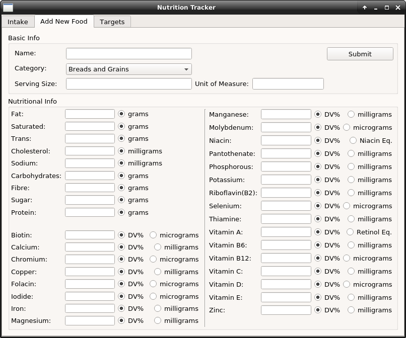

<h2>Intake Tab</h2>

Used to enter and measure daily intake. The top entry in the table is the totals of that day's intake. Changing the date will automatically load the associated date's intake. 

For the progress bars, calories is calculated automatically from macronutrient content, and saturated, trans, and unsaturated fats show the ratio of each type of fat that makes up the total fat intake.

<h2>Add New Food Tab</h2>

Used to submit foods that can be entered in the Intake tab. The serving size is used to calculate the intake serving size relative to the base serving size. For instance, an input serving size of 1 when the base serving size is 2 will result in an actual serving size of 0.5 (1 / 2 = 0.5). An input serving size of 4 will result in an actual serving size of 2.

This allows the user to enter a food label verbatim (in cases like bread where a serving size is measured by 2 slices) and have the program automatically calculate the nutritional value of a fractional or multiple serving.

An important aspect of submitting a food item is in entering whether the micronutrient content is measured in absolute values (milligrams, micrograms, etc.), or, daily values (as defined by Health Canada). An absolute value of 30mg for Vitamin C will simple be stored as 30, whereas 25% of the daily recommended intake of Vitamin C will be calculated as (25 / 100) * 60 = 15mg, where 60 is the recommended daily value of Vitamin C.

The Unit of Measure is just a reminder to the user what a serving size is measured in: slices, cups, each, etc., and is shown next to the food name in the Intake tab.

<h2>Target Tab</h2>

The Target tab is used to set the values that progress bars use as a maximum value. Calories, saturated fat, trans fat, and unsaturated fat can't be set manually but instead are calculated based on intake of macronutrients.

